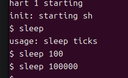
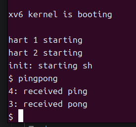
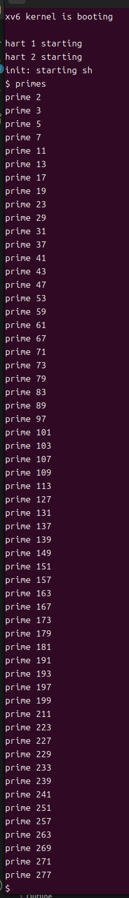

# 操作系统第一次上机实验报告

## 基本信息

- 姓名：张祺昀
- 学号：23300200015

## 一 实验目标

本次实验的核心目标是在 xv6 中实现 `sleep`、`pingpong` 和 `primes` 三个用户程序。具体要求如下：

1. 实现 `sleep`，接收命令行参数并使进程暂停指定的时钟滴答数。
2. 实现 `pingpong`，使用管道完成父子进程之间的双向通信。
3. 实现 `primes`，使用管道和多进程完成并发素数筛选。

Ubuntu、RISC-V 交叉编译工具链、QEMU、GDB 和 Makefile 的学习与配置，是完成上述三个程序所需的实验准备。

## 二 实验环境

| 项目 | 当前配置 |
| --- | --- |
| 虚拟化软件 | VMware |
| 客户机系统 | Ubuntu 64 位 |

## 三 实验任务与完成状态

| 实验任务 | 当前状态 | 说明 |
| --- | --- | --- |
| 环境配置 | 已完成 | Ubuntu、交叉编译器、QEMU 与 GDB 已配置 |
| 运行原始 xv6 | 已完成 | 能够使用 `make qemu` 启动 xv6 |
| `sleep` 源码 | 已完成 | 已创建 `user/sleep.c` |
| Makefile 接入 | 已完成 | 已在 `UPROGS` 中加入 `$U/_sleep\`、`$U/_pingpong\` 和 `$U/_primes\` |
| `sleep` 编译与运行 | 已完成 | 修正新版 API 差异后编译通过，实际运行符合预期 |
| `pingpong` | 已完成 | 已解除死锁，子进程输出 `received ping`，父进程输出 `received pong`，程序正常返回 shell |
| `primes` | 已完成 | 已使用管道、多进程和递归筛选出 `2` 到 `280` 之间的质数 |

## 四 sleep 实验

### 4.1 实验要求

在 xv6 中实现名为 `sleep` 的用户程序。程序接收一个命令行参数，将其转换为整数，并让当前进程暂停相应的时钟滴答数。暂停结束后，程序退出并返回 xv6 shell。

示例：

```text
$ sleep 100
$
```

### 4.2 命令行参数

程序入口为：

```c
int main(int argc, char *argv[])
```

- `argc` 表示命令行参数数量，程序名称本身计为一个参数。
- `argv` 保存每个参数的字符串内容。
- 执行 `sleep 100` 时，`argc` 为 `2`，`argv[0]` 为 `"sleep"`，`argv[1]` 为 `"100"`。
- `argv[1]` 是字符串，需要通过 `atoi()` 转换为整数。

### 4.3 头文件

```c
#include "kernel/types.h"
#include "kernel/stat.h"
#include "user/user.h"
```

- `kernel/types.h` 定义 `uint`、`uint64` 等 xv6 基础数据类型。
- `kernel/stat.h` 定义文件类型常量和 `struct stat`。本程序没有直接使用它，但保留了 xv6 用户程序的常见头文件结构。
- `user/user.h` 声明 xv6 用户程序能够调用的系统调用和用户库函数，例如 `pause()`、`atoi()`、`fprintf()` 和 `exit()`。

### 4.4 程序代码

文件位置：`user/sleep.c`

```c
#include "kernel/types.h"
#include "kernel/stat.h"
#include "user/user.h"

int
main(int argc, char *argv[])
{
    if (argc != 2) {
        fprintf(2, "usage: sleep ticks\n");
        exit(1);
    }

    int ticks = atoi(argv[1]);
    pause(ticks);

    exit(0);
}
```

程序首先检查参数数量。如果用户没有提供暂停时间，程序向文件描述符 `2` 输出用法提示并以错误状态退出。参数正确时，程序通过 `atoi()` 把字符串转换为整数，再调用当前版本 xv6 提供的 `pause()` 系统调用。

### 4.5 接入 Makefile

在项目根目录的 `Makefile` 中找到 `UPROGS`，加入：

```makefile
	$U/_sleep\
```

Makefile 中的程序名带下划线 `_sleep`，在 xv6 shell 中运行时使用不带下划线的 `sleep`。

### 4.6 编译问题与解决过程

第一次执行 `make qemu` 时出现：

```text
user/sleep.c:11:9: error: implicit declaration of function 'sleep'
cc1: all warnings being treated as errors
```

原因是课件基于较早的 xv6 接口，使用 `sleep(int)`；当前克隆的新版 `mit-pdos/xv6-riscv` 已将用户态系统调用更名为 `pause(int)`。当前版本的 `user/user.h` 中声明为：

```c
int pause(int);
```

因此保留程序名 `sleep`，把程序内部调用由：

```c
sleep(ticks);
```

改为：

```c
pause(ticks);
```

该修改适配当前源码，同时保持实验要求的命令名称不变。

### 4.7 编译与运行

在 xv6 项目根目录执行：

```bash
cd ~/os/xv6-riscv
make qemu
```

进入 xv6 后进行以下测试：

| 测试命令 | 预期结果 | 实际结果 |
| --- | --- | --- |
| `sleep 100` | 暂停一段时间后重新出现 `$` | 符合预期，暂停结束后返回提示符 |
| `sleep 100000` | 长时间保持暂停状态 | 符合预期，截图时程序仍在暂停 |
| `sleep` | 输出 `usage: sleep ticks` | 符合预期，正确提示缺少参数 |

运行截图：



截图显示 xv6 已正常启动。直接执行 `sleep` 时程序输出 `usage: sleep ticks`；执行 `sleep 100` 后程序暂停并重新返回 `$`；执行 `sleep 100000` 后在截图时仍未返回提示符，说明进程正在按照参数保持暂停状态。

### 4.8 当前完成情况

`sleep.c` 已完成编写并加入 Makefile。编译过程中发现课件与当前 xv6 源码存在 API 名称差异，改用 `pause(ticks)` 后编译和运行均正常。无参数、短时间暂停和长时间暂停三种情况均符合预期，`sleep` 实验完成。

## 五 pingpong 实验

### 5.1 实验要求

使用 `pipe()`、`fork()`、`read()`、`write()`、`getpid()` 和 `wait()` 实现父子进程之间的双向通信。

### 5.2 设计思路

由于匿名管道是单向字节流，程序建立两条管道：`parent_to_child` 用于父进程发送 ping，`child_to_parent` 用于子进程回复 pong。每条管道的 `[0]` 是读取端，`[1]` 是写入端。两条管道在 `fork()` 之前创建，因此父子进程都能继承这些文件描述符。

通信顺序如下：

1. 父进程向 `parent_to_child[1]` 写入一个字节。
2. 子进程从 `parent_to_child[0]` 读取该字节并输出自己的 PID 和 `received ping`。
3. 子进程向 `child_to_parent[1]` 写回一个字节。
4. 父进程从 `child_to_parent[0]` 读取回复并输出自己的 PID 和 `received pong`。
5. 父进程调用 `wait(0)` 回收子进程，双方关闭不再使用的管道端并退出。

### 5.3 关键代码

子进程先接收 ping，再回复 pong：

```c
close(child_to_parent[0]);
close(parent_to_child[1]);

read(parent_to_child[0], &token, 1);
printf("%d: received ping\n", getpid());
write(child_to_parent[1], &token, 1);
```

父进程必须先发送 ping，再等待 pong：

```c
close(parent_to_child[0]);
close(child_to_parent[1]);

write(parent_to_child[1], &token, 1);
read(child_to_parent[0], &token, 1);
printf("%d: received pong\n", getpid());
wait(0);
```

### 5.4 死锁现象与原因

第一次实现中，父进程和子进程都先执行 `read()`。子进程等待父进程写入 ping，父进程同时等待子进程写入 pong。由于双方都没有机会执行后面的 `write()`，程序运行 `pingpong` 后没有任何输出，也不再返回 `$`，形成死锁。

```text
子进程：read(parent_to_child[0])，等待父进程写入
父进程：read(child_to_parent[0])，等待子进程写入
结果：双方同时等待，后续 write() 均无法执行
```

修复方法是把父进程的操作顺序调整为“先 `write()`，再 `read()`”。子进程保持“先 `read()`，再 `write()`”，从而形成明确的请求与回复顺序。死锁时通过 `Ctrl + A`，松开后按 `X` 退出 QEMU，再修改代码并重新构建。

### 5.5 程序接入问题

解除死锁后曾出现：

```text
exec pingpong failed
```

该信息表示 xv6 shell 无法在当前 `fs.img` 中执行 `pingpong`。检查 `user/pingpong.c`，在 Makefile 的 `UPROGS` 中加入 `$U/_pingpong\`，然后执行 `make clean` 和 `make qemu` 重新生成文件系统镜像，程序即可被 xv6 shell 启动。

### 5.6 当前运行结果



截图表明父子进程通信已经完成：子进程 PID 为 4，接收到父进程发送的字节后输出 `received ping`；父进程 PID 为 3，接收到子进程的回复后输出 `received pong`。程序随后正常返回 `$` 提示符，运行结果符合实验要求。

## 六 primes 实验

### 6.1 实验要求

使用管道和多进程实现并发素数筛选。第一个进程发送 `2` 到 `280`，每个筛选进程输出一个质数并把未被整除的数字传递给下一个进程。

### 6.2 设计思路

程序由一个数字生成进程和多个筛选进程组成。`main()` 先创建第一条管道，父进程把 `2` 到 `280` 依次写入管道，子进程从管道读取数字并调用 `sieve()`。

每层 `sieve()` 的处理流程为：

1. 从 `left_fd` 读取第一个整数，该数已经通过左侧所有筛选进程，因此一定是新的质数。
2. 输出该质数，再创建 `next_pipe` 和下一个子进程。
3. 当前进程继续从 `left_fd` 读取数字，丢弃能被当前质数整除的数字。
4. 其余数字经 `next_pipe[1]` 写给子进程；子进程将 `next_pipe[0]` 作为新一层 `sieve()` 的 `left_fd`。
5. 读取结束后，当前进程先关闭 `next_pipe[1]`，使下一层的 `read()` 能够返回 `0`，然后调用 `wait(0)` 回收子进程。

整体管线可概括为：

```text
生成 2～280 → 筛除 2 的倍数 → 筛除 3 的倍数 → 筛除 5 的倍数 → ……
```

### 6.3 关键代码

数字生成进程把 `2` 到 `280` 依次写入第一条管道：

```c
close(first_pipe[0]);
for (int number = 2; number <= 280; ++number) {
    write(first_pipe[1], &number, sizeof(number));
}
close(first_pipe[1]);
wait(0);
```

每个筛选进程首先读取并输出本层质数：

```c
bytes = read(left_fd, &prime, sizeof(prime));
if (bytes == 0) {
    close(left_fd);
    exit(0);
}
printf("prime %d\n", prime);
```

子进程将新管道的读取端作为下一层输入：

```c
close(next_pipe[1]);
close(left_fd);
sieve(next_pipe[0]);
```

当前进程保留 `next_pipe[1]`，过滤当前质数的倍数：

```c
close(next_pipe[0]);
while (read(left_fd, &number, sizeof(number)) == sizeof(number)) {
    if (number % prime != 0) {
        write(next_pipe[1], &number, sizeof(number));
    }
}
close(left_fd);
close(next_pipe[1]);
wait(0);
```

### 6.4 文件描述符管理

当前筛选进程从 `left_fd` 读取输入，并向 `next_pipe[1]` 写入筛选后的数字，因此要关闭自己不使用的 `next_pipe[0]`。子进程则关闭 `next_pipe[1]` 和旧的 `left_fd`，通过 `sieve(next_pipe[0])` 将该读取端传入下一层。

`fork()` 后父子进程各自拥有一份文件描述符表，所以父进程关闭自己的 `next_pipe[0]` 不会影响子进程使用它读取数据。写入端必须在 `wait(0)` 之前关闭，否则下一层可能一直阻塞在 `read()` 中。

### 6.5 编译与运行结果

在 Makefile 的 `UPROGS` 中加入 `$U/_primes\`，重新执行 `make qemu`，进入 xv6 shell 后运行 `primes`。



程序按从小到大的顺序输出了 `2` 到 `280` 之间的全部 59 个质数，从 `prime 2` 开始，以 `prime 277` 结束。输出中没有出现合数，最后正常返回 `$` 提示符，说明数字生成、递归筛选、管道关闭和子进程回收均正常，`primes` 实验完成。

## 七 问题与解决记录

| 问题 | 原因 | 解决方法 | 结果 |
| --- | --- | --- | --- |
| 主机与 Ubuntu 无法复制粘贴 | VMware Tools 桌面组件或会话类型不符合要求 | 安装 `open-vm-tools-desktop`，启用客户机隔离并使用 Xorg | 已解决 |
| `sleep()` 未声明 | 当前 xv6 将用户态 `sleep()` 更名为 `pause()` | 在 `sleep.c` 中调用 `pause(ticks)` | 已解决，编译运行通过 |
| `pingpong` 运行后无输出 | 父子进程都先调用阻塞式 `read()`，没有进程先写入数据 | 父进程改为先写 ping 再读 pong；子进程保持先读后写 | 已解决，程序不再死锁 |
| `exec pingpong failed` | `pingpong` 未进入当前 xv6 文件系统镜像 | 确认 Makefile 中存在 `$U/_pingpong\` 并完整重建 | 已解决，命令可以运行 |
| 父进程输出 `received ping` | 父进程打印字符串写错 | 改为 `printf("%d: received pong\n", getpid())` | 已解决，运行结果已确认 |
| `left_fd[0]` 无法正确读取 | `left_fd` 已经是单个读取端文件描述符，不是长度为 2 的管道数组 | 改为 `read(left_fd, &prime, sizeof(prime))` | 已解决 |
| 质数输出为错误数值 | `printf()` 传入了 `&prime`，该表达式表示变量地址 | 改为 `printf("prime %d\n", prime)` | 已解决，所有质数正确输出 |

## 八 实验总结

本次实验完成了 xv6 基础环境配置，并完成 `sleep`、`pingpong` 和 `primes` 三个用户程序。通过 `sleep` 掌握了命令行参数的读取、整数转换与系统调用；通过 `pingpong` 掌握了 `fork()`、双管道通信和阻塞式 `read()` 的行为；通过 `primes` 理解了递归创建进程、多进程管线和文件描述符继承。

调试过程说明，管道程序的正确性不仅取决于读写的数据，还取决于通信顺序、每个进程关闭的管道端以及 EOF 的传递。在 `primes` 中，当前进程从 `left_fd` 读取，向 `next_pipe[1]` 写入，而子进程把 `next_pipe[0]` 作为新一层的 `left_fd`，体现了进程管线逐层传递数据的基本思想。

## 九 附录材料清单

| 材料 | 是否已附 | 备注 |
| --- | --- | --- |
| `make qemu` 成功编译截图 | 是 | xv6 已正常启动 |
| `sleep 100` 运行截图 | 是 | 已附于 4.7 节 |
| `sleep` 无参数测试截图 | 是 | 已附于 4.7 节 |
| `user/sleep.c` 完整代码 | 是 | 已记录于 4.4 节 |
| `pingpong` 最终运行截图 | 是 | 已附于 5.6 节，输出符合实验要求 |
| `user/pingpong.c` 关键代码 | 是 | 已记录于 5.3 节 |
| `primes` 最终运行截图 | 是 | 已附于 6.5 节，输出 `2`～`280` 之间的所有质数 |
| `user/primes.c` 关键代码 | 是 | 已记录于 6.3 节 |
| Makefile 修改位置 | 是 | 三个用户程序均已加入 `UPROGS` |
